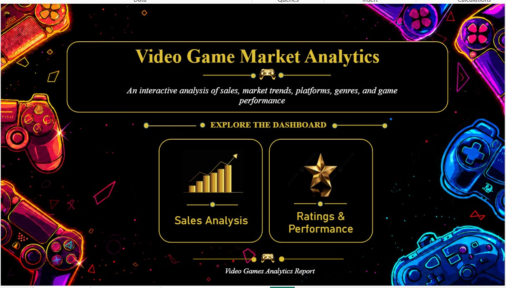
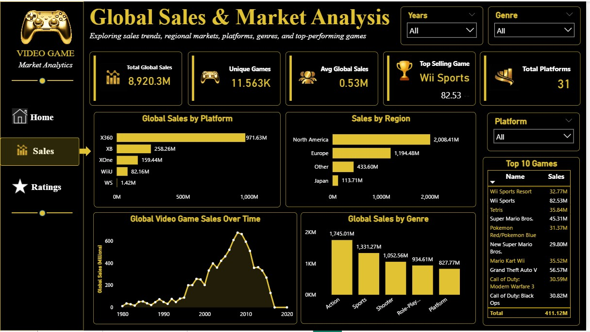
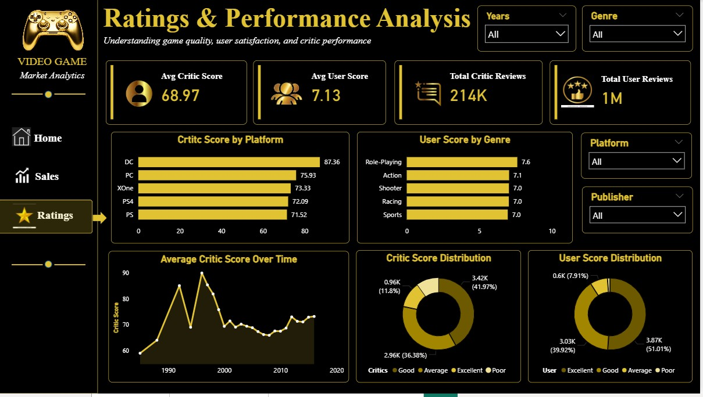

# CodeAlpha_DataVisualization
# 🎮 Video Game Market Analytics Dashboard

An interactive **Power BI Dashboard** that analyzes global video game sales, regional market trends, platform popularity, genre dynamics, and critical/user reception across decades of gaming history.

---

## 📌 Project Overview

This Power BI project transforms raw video game data into actionable business intelligence insights. Built with a dark-themed **Gold & Neon Black UI**, the dashboard delivers a seamless 3-page navigation flow:

* **Page 1: Overview** — Navigation hub and project landing interface.
* **Page 2: Global Sales & Market Analysis** — Detailed revenue, top titles, regional breakdown, and sales over time.
* **Page 3: Ratings & Performance Analysis** — Critic vs. user score comparisons, genre/platform benchmarks, and distribution metrics.

---

## 🗂️ Project Repository Structure

```text
.
├── Overview.jpg        # Screenshot: Page 1 - Dashboard Home Landing Page
├── readme              # Documentation / README file
├── Visualization.pbix  # Power BI file
├── cleaned_data        # video game dataset
├── rating.jpg         # Screenshot: Page 3 - Ratings & Performance Analysis View      
├── sales.jpg           # Screenshot: Page 2 - Global Sales & Market Analysis View
        
```

---

## 📊 Dashboard Pages & Data Storytelling Insights

### 📍 Page 1: Overview / Landing Page (`Overview.jpg`)

The main entry point provides smooth navigation to the analytical modules via interactive buttons.



---

### 📍 Page 2: Global Sales & Market Analysis (`sales.jpg`)

Provides high-level KPI breakdowns, regional market revenue, and historical growth trends.



#### 💡 Key Data Storytelling Points:
* **Massive Market Reach**: Total global sales stand at **$8,920.3M ($8.92 Billion)** across **11,563 unique titles** and **31 distinct platforms**, averaging **0.53M sales per game**.
* **Top Selling Hit**: *Wii Sports* dominates as the single highest-selling game at **82.53M units**, outperforming industry giants like *Grand Theft Auto V* (**56.57M**) and *Super Mario Bros.* (**45.31M**).
* **Regional Dominance**: **North America** leads global video game revenue with **$2,008.41M**, followed by **Europe** (**$1,194.48M**), Other regions (**$433.60M**), and **Japan** (**$113.71M**).
* **Highest Grossing Genres**: **Action** leads all genres at **$1,745.01M**, closely followed by **Sports** (**$1,331.27M**) and **Shooter** (**$1,052.56M**).
* **Golden Era Growth**: Sales grew exponentially through the late 1990s and hit an all-time peak between **2008–2010**, marking the height of physical hardware and console sales.

---

### 📍 Page 3: Ratings & Performance Analysis (`ratings.jpg`)

Examines critical reception versus public user satisfaction across various platforms and genres.



#### 💡 Key Data Storytelling Points:
* **Critic vs. User Disconnect**: Across **214K Critic Reviews** and **1M User Reviews**, critics maintain a mean score of **68.97 / 100**, while users rate games at an average of **7.13 / 10**.
* **Platform Quality Leader**: **PC** achieved the highest average critic score at **75.93**, leading console competitors like **PS3 (70.38)**, **Xbox (69.86)**, and **PS2 (68.73)**.
* **Genre Critical Reception**: **Role-Playing (RPG)** ranks as the highest-rated genre by critics with a **7.6 / 10** average, beating Action (**7.1**), Shooter (**7.0**), and Racing (**7.0**).
* **Rating Distribution Insights**:
  * **Critics**: **41.97% (3.42K)** of evaluated titles fall into the "Good" range, **36.38% (2.96K)** into "Average", and **11.8% (0.96K)** into "Excellent".
  * **Users**: **51.01% (3.87K)** of user reviews classify titles as "Average", **39.92% (3.03K)** as "Good", and only **7.91% (0.6K)** as "Excellent".

---

## 🛠️ Tech Stack

* **BI Tool**: Power BI Desktop
* **Data Prep**: Power Query / DAX
* **Visualizations**: Horizontal Bar Charts, Line Charts, Donut Charts, KPI Cards, Dynamic Slicers
* **Design Theme**: Custom Dark Gold/Neon UI

---

## 🔍 Interactive Features

* **Slicers**: Slice the entire page dynamically by **Years**, **Genre**, **Platform**, and **Publisher**.
* **Navigation**: Jump between Page 1, Page 2, and Page 3 using the sidebar buttons.
* **Top 10 Table**: Explore top revenue-generating games on the Sales page.

